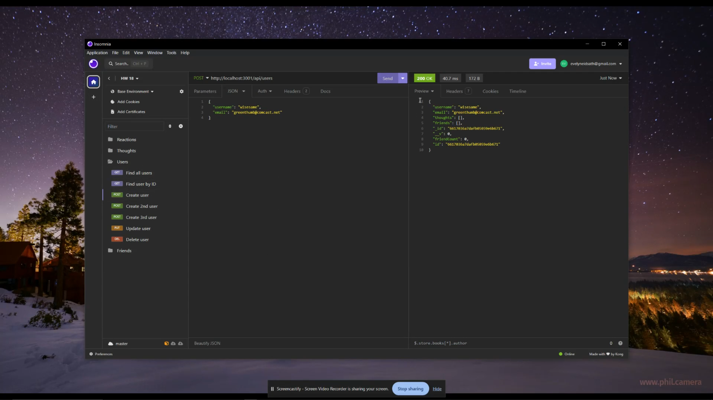

# Social-Network-API

## Description
    
This is an social network API contructed with Express.js and configured to use Mongoose to interact with a MongoDB database. Users can use an API testing program such as Insomnia to send GET, POST, PUT, and DELETE requests to the server to view and manipulate the data of this social network site mock-up.

Social media and networking is a massive industry that plays a part in many people's lives. This makes it extremely valuable to understand the data structures and interactions that are required to create a social network. In this social network API, users can create a user profile, add friends, post 'thoughts', and add reactions to those thoughts. These are all the essential building blocks of any successful social media network.

In creating the routes for this application, I was able to become more familiar with separating GET, POST, PUT, and DELETE requests into controller files that contain the request code, and route files that compile and define the requests in a manner that is straightforward and easy to understand. Also, working with MongoDB and Mongoose helped introduce me to NoSQL systems of data management.
    
## Table of Contents
    
- [Installation](#installation)
- [Usage](#usage)
- [Video](#video)
- [Contributing](#contributing)
- [License](#license)
- [Tests](#tests)
- [Questions](#questions)
    
## Installation
    
Install the latest version of NodeJS, MongoDB, and Insomnia.
Download this repo onto your local computer.
Navigate to the file directory in your terminal and run "npm i" to install the necessary packages.
    
## Usage

After following the installation instructions above:
Open the root of the file directory in your terminal and run "node seeds/index.js" to add the data to your database.
Run the command "npm start" to start the server.
Open Insomnia and set up the routes as seen in the routes/api files and the video demonstration, linked below. Refer to the notes in the code or the video demonstration to see how to format the JSON data for the POST and PUT requests.
Send the GET, POST, PUT, and DELETE requests to view and manipulate the data in the database.

### Video

Click the following image to watch a video demonstrating the functionality of the GET, POST, PUT, and DELETE routes.

    
## Contributing

- Contributors: [eaeidsath](github.com/eaeidsath)
- Credits: The format of routes in the routes JS files was referenced from class materials.
- Contribution instructions: This project is not seeking contributors at this time.

## License

The following license is being used for this project: MIT License.

## Tests

N/A

## Questions

Please direct questions to [eaeidsath](github.com/eaeidsath) or email your questions to evelyneidsath@gmail.com.